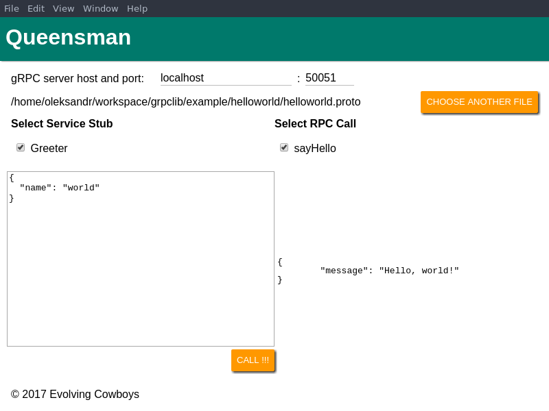

=========
Queensman
=========

+-------------------+----------------+
| **Current state** | Pre-alpha      |
+-------------------+----------------+
| **Platform**      | Cross-platform |
+-------------------+----------------+

    Protocols maketh app

Queensman is an electron application intended to help developing and testing
apps which use `gRPC`_ protocol.

Currently Queensman is in the rough pre-alpha, and no releases exist yet. If
you want to try it, see `Development`_ section.

Development
===========

Commands are conveniently put into :file:`package.json`.

In order to build the application issue the :code:`npm run build` command which
will compile all the javascript and put it into the :file:`build` directory.
After the sources are compiled you can run the application with :code:`npm
start` command.

Unfortunately we do not have a script to produce a debug version of app, but
hope to make it soon.

How to contribute
=================

See `issues`_ page on GitHub.

.. _`gRPC`: https://grpc.io
.. _`react-scripts`: https://github.com/facebookincubator/create-react-app
.. _`issues`: https://github.com/evolving-cowboys/queensman/issues
